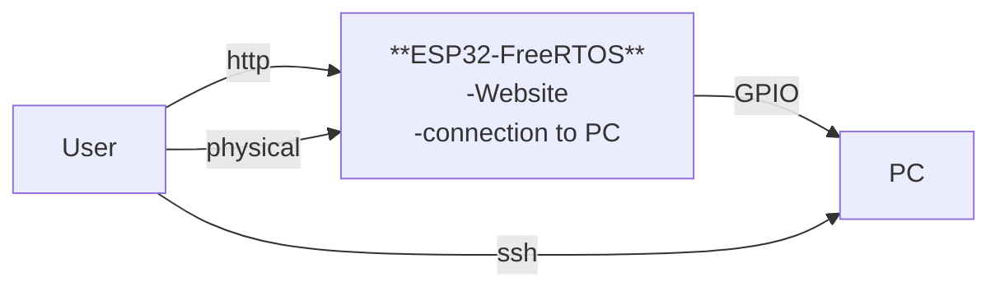
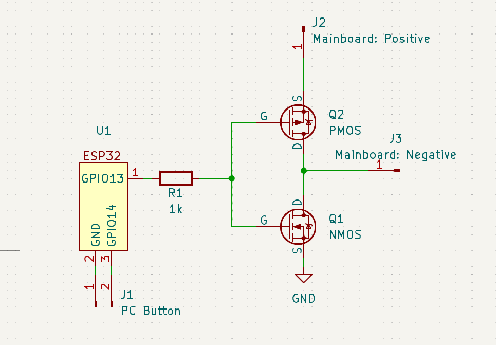

# Repo for a Power over Wifi device

This device should power up a PC wirelessly.
For that it uses the power pins of the mainboard and emulates
a button press when a signal is given to the device.

# Compiling
1. set your WIFIs ssid (wifi name) and password in the code/main/include/wifi_config.h. This will make sure the ESP has the needed credentials and auto connects to your wifi on boot.
2. if you use idf.py enter this in your terminal before compiling, if not install it first [https://github.com/espressif/esp-idf](https://github.com/espressif/esp-idf)
```bash
. <path to esp-idf>/esp-idf/export.sh
```
3. compile and flash your ESP
```bash
idf.py build && idf.py flash
```

Now you are ready to go and have fun.

## Why did i make this project?

I have a PC with an Intel core of gen 13/14 =0. Due to the hardware bug, which degrades my CPU fast and steady, I wanted another cleaner version of the Power-over-Lan functionality, because with PoL the CPU is constantly in deep sleep which seams to draw some power unfortunately. 

## Layout

### General


### MCU


## Schematic

