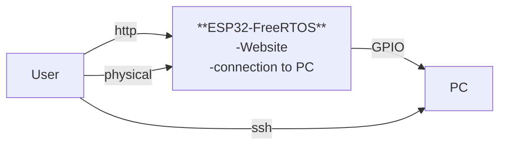
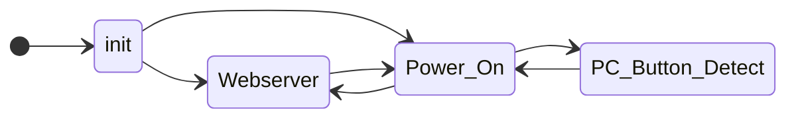

# POW Documentation

This document concludes all the information to replicate this product.

## Layout

### General

```mermaid
graph LR;
    user[User] --> |http| mcu[**ESP32-FreeRTOS** <br> -Website <br> -connection to PC];
    user --> |physical| mcu
    mcu --> |GPIO| PC;
    user --> |ssh| PC;
```

### MCU

```mermaid
stateDiagram
    direction LR
    [*] --> init
    init --> Webserver
    init --> Power_On
    Webserver --> Power_On
    Power_On --> Webserver
    PC_Button_Detect --> Power_On
    Power_On --> PC_Button_Detect
```

## Schematic

## Measurements
Pow_on+ to Pow_on- = 3.3V